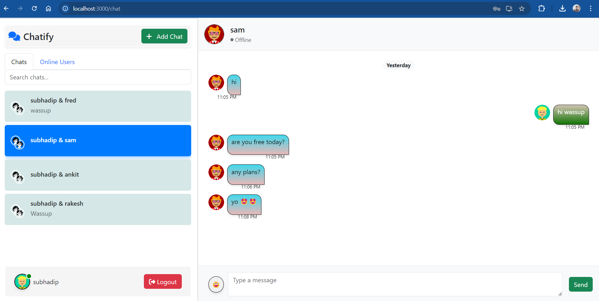

# Chat Application Using FastAPI, React, and MongoDB

Welcome to the **Chat Application** project! This is a full-stack web application that combines **FastAPI** for the backend and **React** for the frontend, with real-time communication powered by **Socket.io** and data stored in **MongoDB Atlas**.

## System Overview

This chat system is designed to support real-time messaging, user authentication, and message persistence using modern web technologies. The system comprises:

- **Backend:** FastAPI
- **Frontend:** React with Bootstrap
- **Database:** MongoDB Atlas
- **Real-time Messaging:** Socket.io

### Architecture Diagram

Here is an overview of the system architecture:

In this architecture:
- The **frontend** is built using **React** and communicates with the backend using **REST API** calls for user management and fetching chat history.
- **Socket.io** is used for real-time communication between clients.
- **FastAPI** serves as the backend REST API and WebSocket server for real-time data.
- **MongoDB Atlas** is used to store user information, chat history, and real-time message persistence.

---

## Backend (FastAPI)

The backend of the application is powered by **FastAPI**, which provides both a REST API for managing users and chat messages, as well as WebSocket for real-time communication. 

Key features of the FastAPI backend:
- **User registration and authentication** using OAuth2 and JWT tokens.
- **Message storage** in MongoDB Atlas.
- **WebSocket support** for real-time messaging.


### **User Endpoints**

#### **POST** `/register`
- **Description:** Register a new user.
- **Request Body:**
  - `email` (String): User's email address
  - `username` (String): Unique username
  - `password` (String): Password for the account
  - `timezone` (String): User's timezone
  - `gender` (String): User's gender

#### **POST** `/login`
- **Description:** Log in an existing user.
- **Request Body:**
  - `username` (String): Unique username
  - `password` (String): Password for the account

#### **GET** `/server_status`
- **Description:** Check the status of the server.
- **Response:**
  - `status` (String): "Online" if the server is operational.

---

### **Admin Endpoints**

#### **DELETE** `/drop_collections`
- **Description:** Drop all MongoDB collections. **(Admin only)**
- **Response:**
  - A confirmation message indicating the collections have been dropped.

---

### **User Profile Endpoints**

#### **PUT** `/users/{user_id}`
- **Description:** Update user information.
- **Path Parameters:**
  - `user_id` (String): The ID of the user to update
- **Request Body:**
  - Fields to update: `email`, `aboutme`, `password`, etc.
  
#### **GET** `/users/{user_id}`
- **Description:** Retrieve information about a user.
- **Path Parameters:**
  - `user_id` (String): The ID of the user to fetch.

---

### **Chat Endpoints**

#### **POST** `/chats/`
- **Description:** Create a new chat between users.
- **Request Body:**
  - `participants` (List of Strings): List of usernames to include in the chat.

#### **GET** `/chats/{chat_id}/messages`
- **Description:** Fetch all messages for a specific chat.
- **Path Parameters:**
  - `chat_id` (String): The ID of the chat to fetch messages for.

#### **GET** `/chats`
- **Description:** Fetch all chats for the logged-in user with pagination support.
- **Query Parameters:**
  - `page` (Integer): Page number for pagination (default is 1).
  - `limit` (Integer): Number of chats to fetch per page (default is 10).

---

This documentation provides a clear overview of the available endpoints, describing each endpoint's functionality, the required input (e.g., path parameters or request body), and the expected output.

`http://localhost:8000/docs`


## Frontend (React + Bootstrap)

The **React** frontend is designed to be responsive, leveraging **Bootstrap 5.3** for layout and styling. The application includes two main views:

1. **Chat List View**: Displays all conversations.
2. **Chat Detail View**: Displays the messages in the selected conversation with a message input form for sending messages.

Key components:
- **ChatList:** Shows a list of chats for the current user.
- **ChatDetail:** Displays the conversation for a selected chat.
- **MessageForm:** Allows the user to type and send messages.

### UI Design

Here's an example of how the frontend layout is structured:




---

## Real-time Messaging (Socket.io)

Real-time messaging is achieved with **Socket.io** on both the backend and frontend. The FastAPI WebSocket route connects clients to the chat room and broadcasts new messages to all participants.


- **Client-Side:** Messages sent from the chat input are transmitted via WebSocket to the backend.
- **Server-Side:** FastAPI WebSocket handles broadcasting the messages to the appropriate chat participants.
  
---

## Database (MongoDB Atlas)

We use **MongoDB Atlas** to store user profiles, chat lists, and message history. The database is structured with collections for **users**, **chats**, and **messages**.

### MongoDB Schema

#### **Users Collection:**

| Field            | Type      | Description                                         |
|------------------|-----------|-----------------------------------------------------|
| `_id`            | ObjectId  | Unique user ID                                      |
| `email`          | String    | User's email address                                |
| `online_status`  | String    | Current status of the user (e.g., Online, Offline)  |
| `timezone`       | String    | User's timezone (e.g., IST)                         |
| `aboutme`        | String    | Short bio of the user                               |
| `username`       | String    | Unique username                                     |
| `password`       | String    | Hashed password for authentication                  |
| `gender`         | String    | User's gender                                       |
| `avatarUrl`      | String    | URL to the user's avatar image                      |
| `creation_date`  | Date      | Timestamp of account creation                       |

---

#### **Chats Collection:**

| Field                | Type      | Description                                         |
|----------------------|-----------|-----------------------------------------------------|
| `_id`                | String    | Unique chat identifier (composite of usernames)     |
| `name`               | String    | Chat name, often based on participants              |
| `image`              | String    | URL for chat image (auto-generated)                 |
| `participants`       | Array     | List of usernames involved in the chat              |
| `created_at`         | Date      | Timestamp when the chat was created                 |
| `created_by`         | String    | Username of the user who created the chat           |
| `last_updated`       | Date      | Timestamp of the last update                       |
| `last_updated_by`    | String    | Username of the user who last updated the chat      |
| `latestMessage`      | String    | The latest message in the chat                     |
| `unreadMessageCounter`| Integer  | Count of unread messages                           |

---

#### **Messages Collection** (Embedded in `Chats`):

| Field     | Type      | Description                                     |
|-----------|-----------|-------------------------------------------------|
| `content` | String    | Message content                                 |
| `sender`  | String    | Username of the message sender                  |
| `receiver`| Array     | Array of recipient usernames                    |
| `time`    | Date      | ISO timestamp of when the message was sent      |

---

This schema reflects how user information, chat details, and messages are structured within MongoDB.


## Running the Application

### Prerequisites

To run this application, ensure that you have the following installed:
- **Node.js** and **npm** (for React frontend)
- **Python 3.8+** (for FastAPI backend)
- **MongoDB Atlas** account (for database)

### Installation and Setup

1. Clone the repository:

   ```bash
   git clone https://github.com/SubhadipGitHub/ChatWebApp.git

### Run the Backend

`cd Backend`
`create a .env file`
`
MONGO_URI='xxxxxxxx'
ADMIN_USER='admin'
ADMIN_PASS='password'
ADMIN_EMAIL='admin@admin.com'
ADMIN_GENDER='male'
ADMIN_TIMEZONE='Asia/Kolkata'
`
`uvicorn app:app --reload`

#### Run the Frontend

`cd Frontend`
`cd chat-app`
`npm start`

#### Issues

Sometimes if you are working in Mongo DB Atlas the network access for local might change.Either you add current IP or give it all IP permissionIn production usually give production domain IP permission.

#### Mentions

https://multiavatar.com/